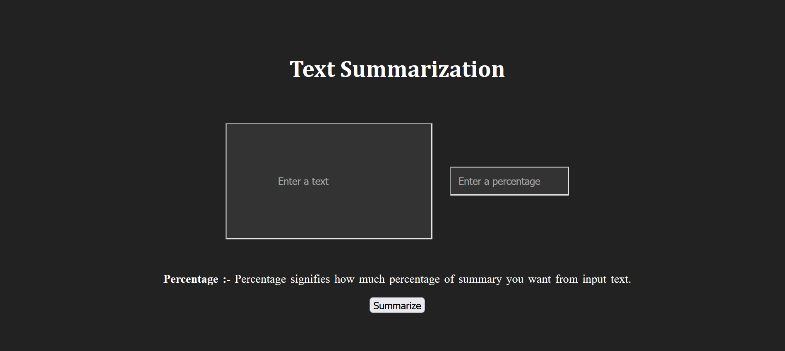
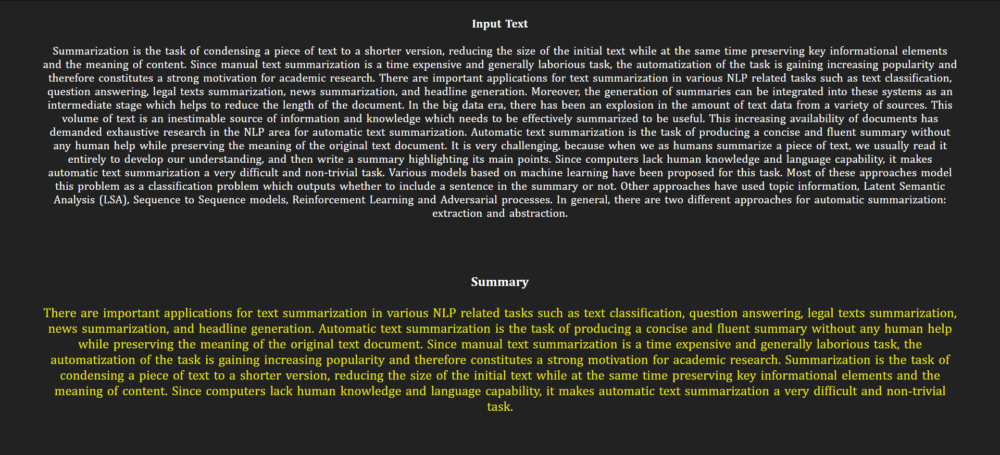

# Text_Summarization
- Text summarization is a very useful and important part of Natural Language Processing (NLP).
- Text summarization is the process of creating shorter text without removing the semantic structure of text.

# Purpose

Suppose we have too many lines of text data in any form, such as from articles or magazines or on social media. 
We have time scarcity so we want only a nutshell report of that text. 
We can summarize our text in a few lines by removing unimportant text and converting the same text into smaller semantic text form.

# Images

 

# model
In this approach I build algorithms or programs which will reduce the text size and create a summary of our text data. This is called automatic text summarization in machine learning.

# To run the code
Download all the files in a one folder and run text_suammrization.py file on python.
